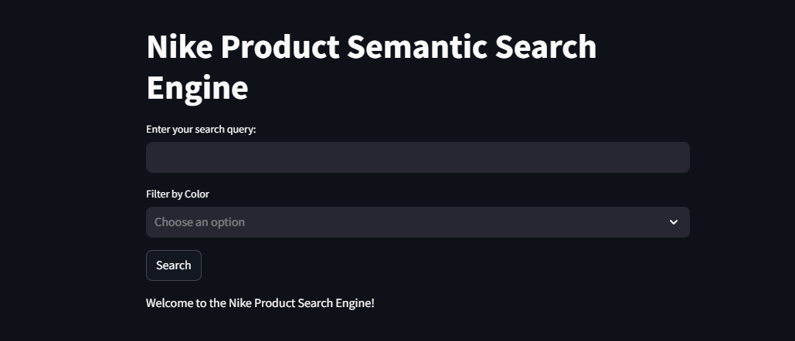

# 🎯 Nike Product Semantic Search Engine

Welcome to the **Nike Product Semantic Search Engine**, an innovative solution designed to revolutionize product recommendations on Nike's e-commerce platform. This repository contains everything you need to run, understand, and extend this semantic search tool.

---

## 🎥 Demo Video

Watch the demo video to see the **Nike Product Semantic Search Engine** in action:

[](https://drive.google.com/file/d/1qbSc5lDnBCL1r45JRcbA-37qfxURhlKi/view?usp=sharing)

---

## 🌟 Project Overview

This project aims to create a **domain-specific semantic search tool** tailored for Nike products. By leveraging advanced **natural language processing (NLP)** techniques like Sentence-BERT (SBERT), the search engine provides a smarter, more intuitive way to match queries with relevant products.

### 🔑 Key Features

- **Semantic Search**: Context-aware search using SBERT embeddings.
- **Query Expansion**: Expands search queries with synonyms for better results.
- **Knowledge Graph Simulation**: Visualizes product relationships using NetworkX.
- **User-Friendly Interface**: Built with **Streamlit** for a seamless user experience.
- **Optimized Performance**: Embedding caching for lightning-fast search operations.

---

## 📁 Repository Structure

```plaintext
├── notebooks/
│   ├── data_preprocessing.ipynb    # Data cleaning and preparation
│   ├── EDA.ipynb                   # Exploratory data analysis
│   └── search_engine.ipynb         # Core search engine development
├── scripts/
│   └── app.py                      # Streamlit-based user interface
├── data/
│   ├── semantic_search_ready_data.csv      # Preprocessed product data
│   ├── semantic_search_with_embeddings.csv # Dataset with embeddings
│   └── embeddings_cache.joblib             # Cached embeddings
```

---

## 🚀 Getting Started

### 🛠️ Prerequisites

Ensure you have the following installed:

- Python 3.8 or higher
- Required Libraries:
  - `pandas`
  - `numpy`
  - `scikit-learn`
  - `sentence-transformers`
  - `nltk`
  - `networkx`
  - `streamlit`
  - `joblib`

### ⚙️ Setting Up Your Environment

1. **Clone the Repository**:

   ```bash
   git clone https://github.com/Birkity/nike-product-semantic-search.git
   cd nike-product-semantic-search
   ```

2. **Create and Activate a Virtual Environment**:

   ```bash
   python -m venv myenv
   source myenv/bin/activate  # On Windows: myenv\Scripts\activate
   ```

3. **Install Dependencies**:
   ```bash
   pip install -r requirements.txt
   ```

## 🏃‍♀️ Running the Application

### 1. Data Preprocessing

Open `data_preprocessing.ipynb` in Jupyter Notebook or Google Colab and:

- Clean the data.
- Handle missing values.
- Prepare the data for NLP tasks.

### 2. Exploratory Data Analysis (EDA)

Run `EDA.ipynb` to gain insights into:

- Dataset distribution.
- Key relationships.
- Metrics influencing search relevance.

### 3. Build the Search Engine

Use `search_engine.ipynb` to:

- Compute SBERT embeddings.
- Implement semantic search using cosine similarity.
- Expand queries and simulate product relationships with a knowledge graph.

### 4. Launch the User Interface

Navigate to the `/scripts` directory and run:

```bash
streamlit run app.py
```

This will start a local web server with a user-friendly interface for interacting with the search engine.

---

## 💡 Usage

1. **Enter a Search Query**:
   - Type your query (e.g., "running shoes for men") in the input field.
2. **Filter Results (Optional)**:

   - Select product colors from the dropdown menu.

3. **View Results**:
   - Click **Search** to see:
     - Top 5 results ranked by relevance.
     - Knowledge graph insights (if applicable).

---

## 🖼️ Example Queries and Outputs

### Query: `"running shoes for men"`

- **Result**: Displays products like _Nike Air Pegasus 83 Premium_, highlighting features like running and comfort.

### Query: `"soccer"`

- **Result**: Recommends soccer-related gear, e.g., _Chelsea FC Strike_ track jackets, focusing on training needs.

> **Note**:
>
> 

---

## 🤝 Contributing

We welcome contributions! 🎉 If you have ideas for enhancements or bug fixes, feel free to:

1. **Fork the repository**.
2. **Create a new branch**.
3. **Submit a pull request**.

```

```
